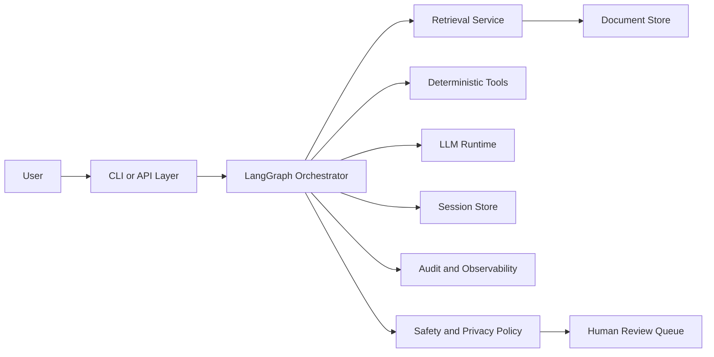
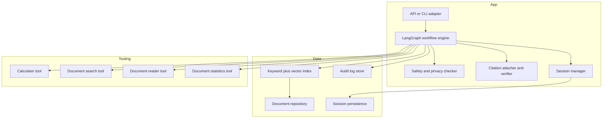
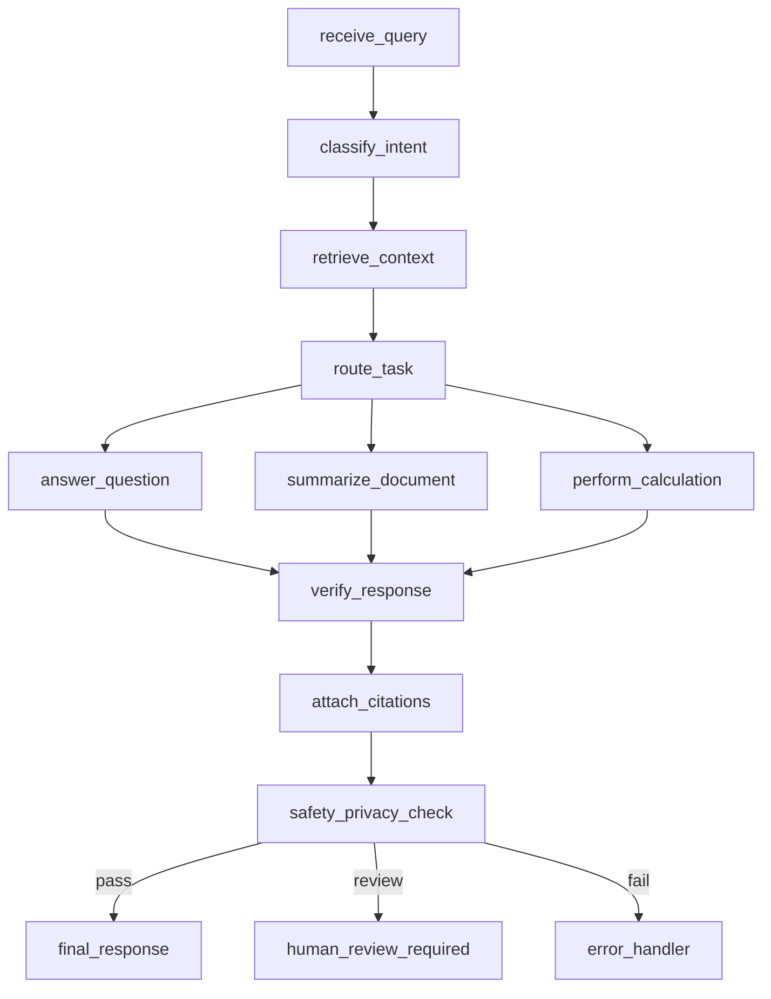
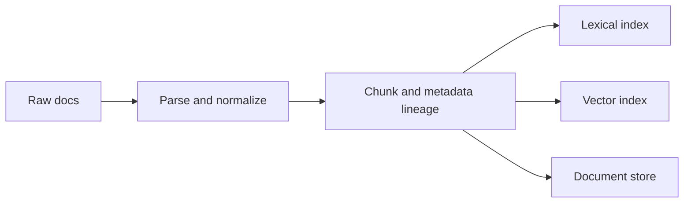
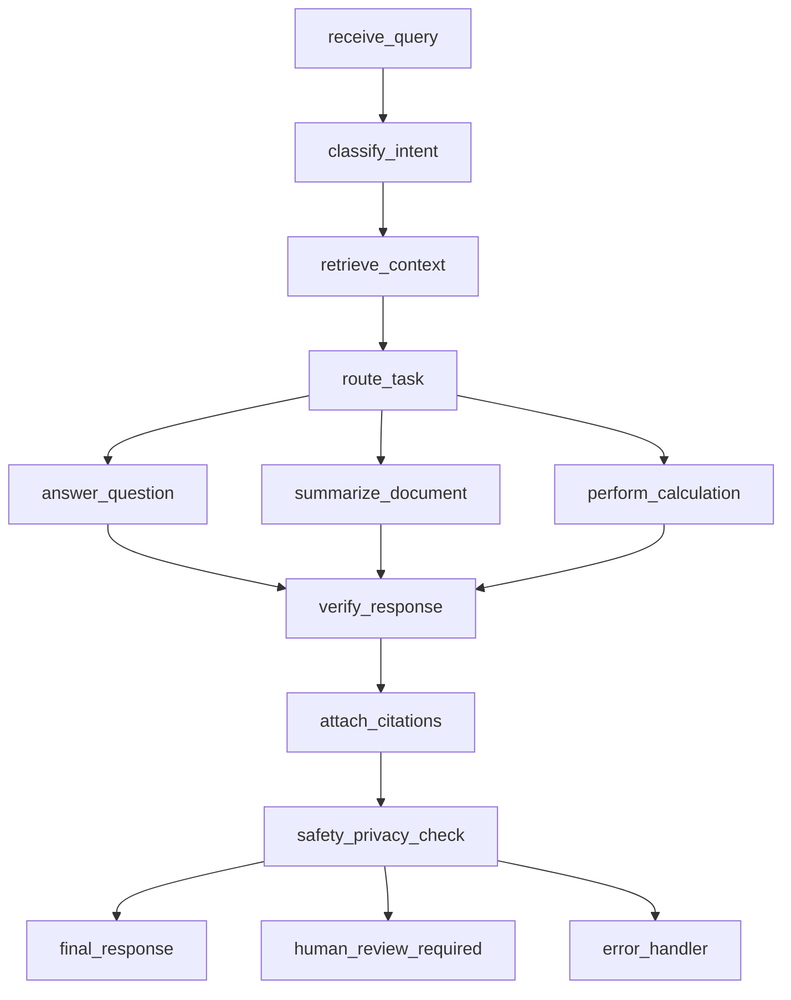
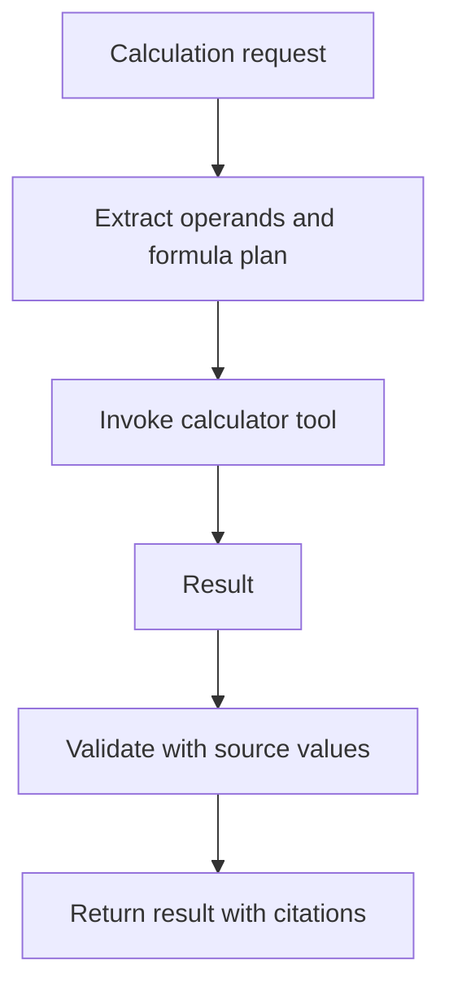
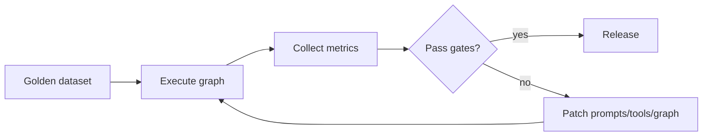

# ARCHITECTURE

## Goal
Define a production-grade but simple architecture for document QA, summarization, and deterministic calculations in financial and healthcare contexts.

## 1) System Context

## 2) Container and Component Diagram

## 3) LangGraph Design Overview
Target graph pattern with deterministic boundaries around retrieval, calculation, citation, and safety:
- receive_query
- classify_intent
- retrieve_context
- route_task
- answer_question or summarize_document or perform_calculation
- verify_response
- attach_citations
- safety_privacy_check
- final_response
- human_review_required
- error_handler

## 4) State Schema
- Core fields:
  - request_id
  - session_id
  - user_id
  - user_input
  - intent
  - retrieved_docs
  - evidence_spans
  - calculation_plan
  - tool_outputs
  - draft_response
  - citations
  - safety_flags
  - confidence
  - actions_taken
  - error

Current baseline state reference:
- [module-01-langchain-fundamentals/doc_assistant_project/src/agent.py](../src/agent.py)

## 5) Node Responsibilities
- classify_intent: classify only, no generation.
- retrieve_context: deterministic retrieval and ranking.
- route_task: select qa, summary, calc path.
- answer_question: grounded answer generation.
- summarize_document: structured summary generation.
- perform_calculation: expression creation plus deterministic tool compute.
- verify_response: consistency checks, numeric and citation checks.
- attach_citations: mandatory citations for claims.
- safety_privacy_check: policy gate for PHI/PII and domain safety.
- human_review_required: route high-risk outputs.
- final_response: format and return.
- error_handler: structured failure envelope.

## 6) Conditional Edges and Routing Logic
- Intent-based primary route.
- Safety-based secondary route after content generation.
- Verification failures route to error_handler or human_review_required depending on severity.

## 7) Tool Design
- Keep tools deterministic, side-effect controlled, and typed.
- Calculator tool must not allow non-arithmetic operations.
- Retrieval tools should return machine-readable payload + optional human-readable rendering.

Current tools baseline:
- [module-01-langchain-fundamentals/doc_assistant_project/src/tools.py](../src/tools.py)

## 8) Retrieval Architecture
- Current: in-memory keyword and metadata filtering.
- Target: hybrid retrieval:
  - lexical filter (bm25/keyword)
  - vector semantic retrieval
  - metadata constraints (doc_type, date, amount)
  - reranker with citation span extraction

Current baseline:
- [module-01-langchain-fundamentals/doc_assistant_project/src/retrieval.py](../src/retrieval.py)

## 9) Document Processing Architecture
- Current: hardcoded sample docs loaded at startup.
- Target pipeline:
  - ingest raw documents
  - parse and normalize
  - chunk with metadata lineage
  - index lexical and vector representations
  - store traceability metadata

## 10) Calculation Architecture
- Deterministic only for arithmetic results.
- LLM may identify operands and formula, but execution must be tool-based.
- Calculation output should include:
  - expression
  - values and source provenance
  - result and units

## 11) Summarization Architecture
- Retrieval-scoped summarization only.
- Enforce structure:
  - executive summary
  - key points
  - risks/unknowns
  - citations

## 12) Q and A Architecture
- Grounded answering:
  - retrieve evidence
  - compose answer only from evidence
  - if insufficient evidence, state inability

## 13) Citation and Source Grounding Strategy
- Citation object should include:
  - doc_id
  - chunk_id/span offsets
  - quote snippet
- Post-generation citation verifier checks claim-to-evidence mapping.

## 14) Memory and Session Strategy
- Short-term turn state in LangGraph checkpoint.
- Long-term session persistence in structured session store.
- Separate conversational summary from factual evidence cache.

Current session baseline:
- [module-01-langchain-fundamentals/doc_assistant_project/src/assistant.py](../src/assistant.py)

## 15) Error Handling Strategy
- Use typed error categories:
  - retrieval_error
  - tool_error
  - validation_error
  - safety_block
  - system_error
- Return user-safe message plus internal diagnostic event.

## 16) Human Review Strategy
- Trigger conditions:
  - healthcare high-risk interpretation
  - missing citations with high confidence claim
  - large financial impact calculations
- Human review node returns approved or rejected response path.

## 17) Observability Strategy
- Track:
  - latency per node
  - retrieval hit rate
  - citation coverage
  - calculation mismatch rate
  - safety flag rates
- Persist trace events linked by request_id and session_id.

## 18) Evaluation Strategy
- Golden datasets per task and domain.
- Automated checks for:
  - citation presence and validity
  - numeric correctness
  - refusal policy compliance
- Regression gating in CI.

## 19) Security and Privacy Strategy
- Secret management by environment and vault in deployment.
- Data minimization in logs.
- PHI/PII redaction for stored traces.
- Access controls per user/org context.

## 20) Deployment Considerations
- Separate environments for dev/staging/prod.
- Model and prompt version pinning.
- Feature flags for tool and policy changes.
- Optional managed stores for sessions, audit, and index.

## Required Diagrams

### A) End-to-End Request Lifecycle

### B) Document Ingestion Pipeline

### C) LangGraph Node and Edge Diagram

### D) Retrieval and Citation Flow

### E) Calculation Tool Flow

### F) Evaluation Loop

