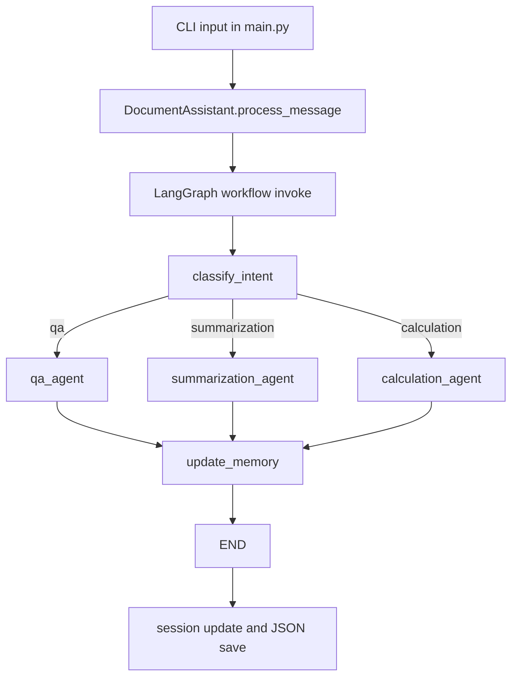
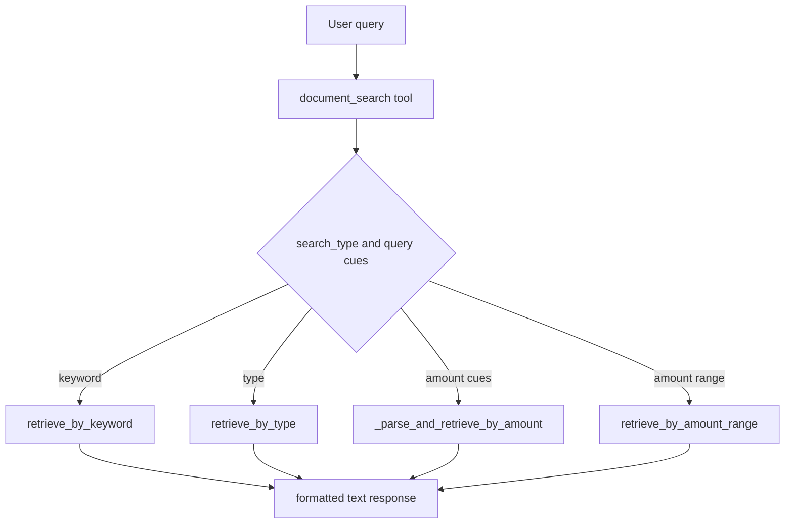

# CURRENT BEHAVIOR

## Scope and Method
This document describes behavior observed in code and runtime flow only. No intended behavior is treated as implemented unless present in source.

## Observed Facts

### 1) Supported User Workflows
- Interactive CLI session with commands /help, /docs, /quit in [module-01-langchain-fundamentals/doc_assistant_project/main.py](../main.py).
- User can send freeform prompts and receive a response through DocumentAssistant.process_message in [module-01-langchain-fundamentals/doc_assistant_project/src/assistant.py](../src/assistant.py).
- Session start and resume using JSON files in [module-01-langchain-fundamentals/doc_assistant_project/src/assistant.py](../src/assistant.py): start_session, _load_session, _save_session.

### 2) Unsupported but Implied Workflows
- No file upload endpoint or parser despite project goal of document processing.
- No batch ingestion, OCR, table extraction, or PDF parser.
- No authentication/authorization workflow.
- No explicit user feedback or human approval interaction loop.

### 3) How Documents Are Loaded
- SimulatedRetriever initializes with hardcoded sample document data in _load_sample_documents at [module-01-langchain-fundamentals/doc_assistant_project/src/retrieval.py](../src/retrieval.py).
- Document types present are invoice, contract, claim in same file.

### 4) How Chunks Are Created
- There is no chunking pipeline.
- Documents are represented as full-content DocumentChunk objects in retrieval methods in [module-01-langchain-fundamentals/doc_assistant_project/src/retrieval.py](../src/retrieval.py).

### 5) How Retrieval Works
- Retrieval methods include:
  - retrieve_by_keyword
  - retrieve_by_type
  - retrieve_by_amount_range
  - retrieve_by_exact_amount
  - retrieve_by_approximate_amount
  - retrieve_by_amount and _parse_and_retrieve_by_amount
  - get_document_by_id
- All are in-memory operations over a Python dict in [module-01-langchain-fundamentals/doc_assistant_project/src/retrieval.py](../src/retrieval.py).
- Search tool wraps retrieval and formats results in create_document_search_tool in [module-01-langchain-fundamentals/doc_assistant_project/src/tools.py](../src/tools.py).

### 6) How Answers Are Generated
- Node qa_agent builds a prompt via get_chat_prompt_template("qa") and invokes create_react_agent through invoke_react_agent in [module-01-langchain-fundamentals/doc_assistant_project/src/agent.py](../src/agent.py).
- Response schema enforced for QA is AnswerResponse from [module-01-langchain-fundamentals/doc_assistant_project/src/schemas.py](../src/schemas.py).

### 7) How Summaries Are Generated
- Node summarization_agent mirrors qa_agent pattern but uses intent-specific prompt and SummarizationResponse schema in [module-01-langchain-fundamentals/doc_assistant_project/src/agent.py](../src/agent.py).

### 8) How Calculations Are Handled
- Calculation node uses create_react_agent with CalculationResponse schema in [module-01-langchain-fundamentals/doc_assistant_project/src/agent.py](../src/agent.py).
- Calculator tool executes expression using Python eval with regex character filter in create_calculator_tool at [module-01-langchain-fundamentals/doc_assistant_project/src/tools.py](../src/tools.py).
- Prompt instructs always use calculator tool for calculations in CALCULATION_SYSTEM_PROMPT at [module-01-langchain-fundamentals/doc_assistant_project/src/prompts.py](../src/prompts.py).

### 9) Healthcare-Specific Handling
- Domain handling is prompt-level only (healthcare wording appears in system prompts in [module-01-langchain-fundamentals/doc_assistant_project/src/prompts.py](../src/prompts.py)).
- No healthcare policy engine, no clinical safety classifier, no escalation path observed.

### 10) Financial-Specific Handling
- Retrieval includes amount-aware filters in [module-01-langchain-fundamentals/doc_assistant_project/src/retrieval.py](../src/retrieval.py).
- Prompt-level framing for financial document assistance in [module-01-langchain-fundamentals/doc_assistant_project/src/prompts.py](../src/prompts.py).
- No deterministic accounting validation layer beyond calculator tool.

### 11) How Errors Are Handled
- process_message catches broad exceptions and returns success False with error string in [module-01-langchain-fundamentals/doc_assistant_project/src/assistant.py](../src/assistant.py).
- Each tool function returns formatted error strings and logs errors in [module-01-langchain-fundamentals/doc_assistant_project/src/tools.py](../src/tools.py).
- No typed error taxonomy, retry policy, or structured failure envelope beyond these return values.

### 12) Where State Is Stored
- LangGraph state persisted by InMemorySaver checkpointer during process runtime in [module-01-langchain-fundamentals/doc_assistant_project/src/agent.py](../src/agent.py).
- Session snapshots persisted to JSON files in [module-01-langchain-fundamentals/doc_assistant_project/sessions](../sessions) through _save_session in [module-01-langchain-fundamentals/doc_assistant_project/src/assistant.py](../src/assistant.py).

### 13) Where User, Session, and Document Context Is Stored
- Session metadata and conversation history in SessionState objects in [module-01-langchain-fundamentals/doc_assistant_project/src/schemas.py](../src/schemas.py) and saved by [module-01-langchain-fundamentals/doc_assistant_project/src/assistant.py](../src/assistant.py).
- Active document IDs stored in session document_context and updated from final_state active_documents in [module-01-langchain-fundamentals/doc_assistant_project/src/assistant.py](../src/assistant.py).
- Tool usage persisted in logs directory by ToolLogger in [module-01-langchain-fundamentals/doc_assistant_project/src/tools.py](../src/tools.py).

### 14) Where the Architecture Is Brittle or Unclear
- AgentState shape in [module-01-langchain-fundamentals/doc_assistant_project/src/agent.py](../src/agent.py) does not explicitly define conversation_history, but process_message sends it in initial_state in [module-01-langchain-fundamentals/doc_assistant_project/src/assistant.py](../src/assistant.py).
- main.py prints sources from active_documents key, but process_message returns sources key, not active_documents in [module-01-langchain-fundamentals/doc_assistant_project/main.py](../main.py) and [module-01-langchain-fundamentals/doc_assistant_project/src/assistant.py](../src/assistant.py).
- SessionState.document_context default uses lambda returning list type instead of empty list value in [module-01-langchain-fundamentals/doc_assistant_project/src/schemas.py](../src/schemas.py).
- requirements.txt not aligned with pyproject, creating install ambiguity.
- create_react_agent output and tool message extraction logic may not capture tool names robustly because it filters ToolMessage with .name in [module-01-langchain-fundamentals/doc_assistant_project/src/agent.py](../src/agent.py).

## Current Execution Flow

## Retrieval Behavior View

## Assumptions and Inferences (Explicit)
- The code appears to be coursework-oriented and optimized for concept demonstration, not hardened production reliability.
- The current LangGraph flow likely serves as a pedagogical scaffold for future enhancements.

## Behavior Summary
- Current system can route user requests by intent and produce LLM responses using tools over a simulated in-memory document set.
- It does not yet implement robust enterprise document processing behavior required for high-risk healthcare/financial deployments.
