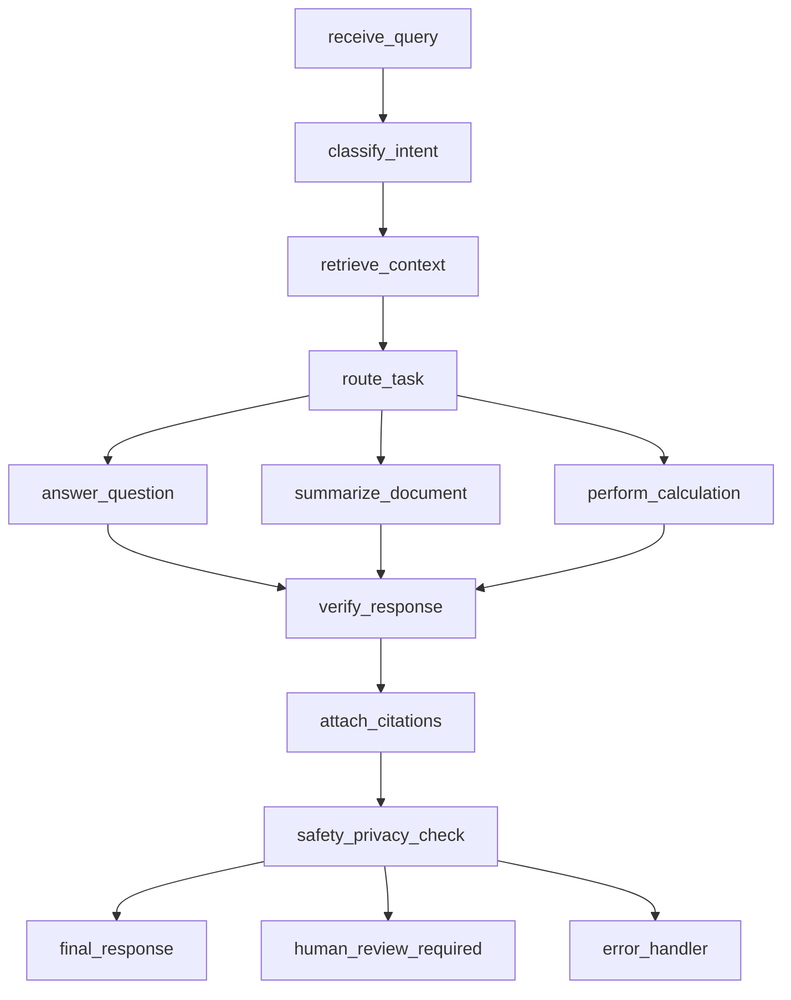

# LANGGRAPH DESIGN

## Objective
Define the intended graph contract for a robust document assistant while staying close to the current implementation.

## 1) State Object

Proposed canonical state:
- request_id: str
- session_id: str
- user_id: str
- user_input: str
- messages: list
- intent: object
- next_step: str
- retrieval_query: str
- retrieved_docs: list
- active_documents: list[str]
- evidence_spans: list
- calculation_plan: object
- tool_outputs: list
- current_response: object
- citations: list
- conversation_summary: str
- safety_flags: list[str]
- confidence: float
- actions_taken: list[str]
- error: object

Current baseline state reference:
- [module-01-langchain-fundamentals/doc_assistant_project/src/agent.py](../src/agent.py)

## 2) Input Schema
- user_input: string
- session_id: string
- user_id: string
- optional metadata: tenant_id, policy_profile

## 3) Output Schema
- success: bool
- response_text: string
- intent: object
- sources: list
- citations: list
- tools_used: list
- safety_outcome: pass or blocked or review
- error: object optional

## 4) Nodes
- receive_query
- classify_intent
- retrieve_context
- route_task
- answer_question
- summarize_document
- perform_calculation
- verify_response
- attach_citations
- safety_privacy_check
- final_response
- human_review_required
- error_handler

## 5) Edges
- receive_query -> classify_intent
- classify_intent -> retrieve_context
- retrieve_context -> route_task
- route_task -> answer_question or summarize_document or perform_calculation
- task node -> verify_response
- verify_response -> attach_citations
- attach_citations -> safety_privacy_check
- safety_privacy_check -> final_response or human_review_required or error_handler

## 6) Conditional Routing
- route_task based on intent type.
- safety_privacy_check based on risk flags.
- verify_response based on citation coverage and calculation checks.

## 7) Interrupts
- human_review_required pauses execution and records pending decision.
- Timeout interrupts for tool failures route to error_handler.

## 8) Retry Policy
- Retrieval retries for transient errors: up to 2.
- Tool retries for deterministic errors: 1 after input sanitation.
- LLM retries for schema parse errors: up to 2 with stricter instructions.

## 9) Error States
- retrieval_error
- tool_execution_error
- citation_validation_error
- safety_blocked
- unknown_intent_error
- internal_system_error

## 10) Persistence and Checkpointing Strategy
- Short-term: LangGraph checkpointer keyed by thread_id.
- Long-term: session records in durable store.
- Persist major node transitions and outputs for audit.

Current baseline checkpointer:
- [module-01-langchain-fundamentals/doc_assistant_project/src/agent.py](../src/agent.py)

## 11) Streaming Strategy
- Optional streaming for generation nodes.
- Always defer final emission until citation and safety checks pass.

## 12) Human-in-the-loop Points
- Post safety_privacy_check when flags indicate clinical or financial risk.
- Post verify_response when citation confidence is low.

## 13) Tool Invocation Boundaries
- Tools are callable only in retrieve_context and perform_calculation task phases.
- No direct tool access in final_response formatting.

## 14) Deterministic Work Before LLM Calls
- Input sanitation.
- Retrieval pre-filtering by metadata.
- Candidate source selection.
- Numeric extraction candidates for calculation requests.

## 15) Post-LLM Deterministic Work
- Citation attachment and validation.
- Calculation consistency checks.
- Safety policy enforcement.
- Response schema validation.

## Suggested Graph Diagram

## Mapping to Current Repo
- Existing implemented nodes:
  - classify_intent
  - qa_agent
  - summarization_agent
  - calculation_agent
  - update_memory
- Existing graph file:
  - [module-01-langchain-fundamentals/doc_assistant_project/src/agent.py](../src/agent.py)
- Existing gaps:
  - no explicit retrieve_context node
  - no explicit verify_response node
  - no explicit attach_citations node
  - no explicit safety_privacy_check node
  - no human_review_required node
